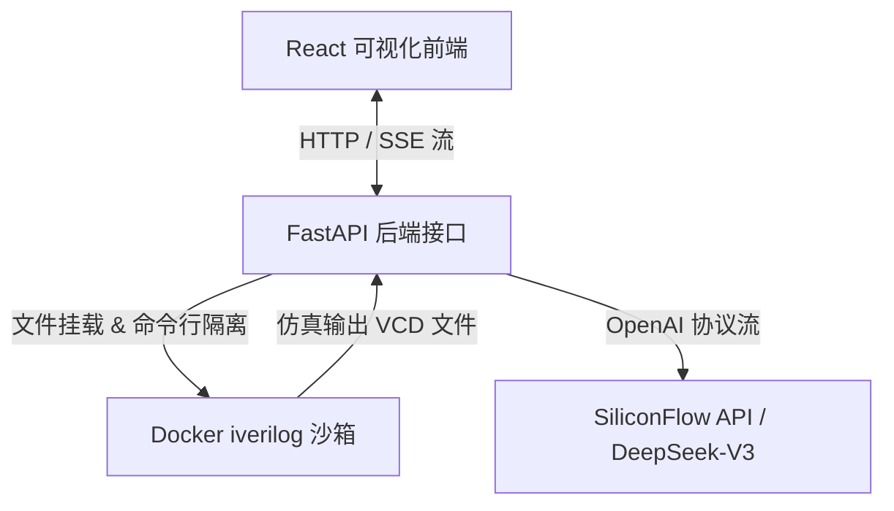

# RTL-Tutor & AutoChip 系统归档与设计文档

本项目是一个**大语言模型（LLM）驱动的交互式 Verilog 在线学习与诊断系统**。它将离线的 AutoChip 硬件代码自动评估流，升级为一个包含“实时语法检查（Linter）、Docker 仿真编译沙箱、SVG 时序波形绘制、双模 AI 电路导师诊断台”的现代化 Web 应用。

---

## 一、 系统架构设计

系统由**前端可视化交互端（React/Vite）**与**后端硬件仿真与 AI 接口服务（FastAPI）**双轨构成，并通过 Docker 沙箱容器提供安全的硬件代码仿真：



---

## 二、 核心功能特性

### 2.1 交互式设计区与自适应多面板布局
* **三栏拖拽响应式布局**：左侧为题目接口与描述，中间为 Monaco 代码编辑器与底部控制台，右侧为 AI 电路导师诊断台。各列宽度可通过垂直把手拖拽自由调节。
* **底部控制台高度拉伸**：在编辑器和控制台（Console Logs / Waveforms）之间加入了水平拉伸把手（`.console-resizer-handle`），支持实时纵向拉伸，自动调节编辑器占比。
* **提问区边界整体缩放**：右侧 AI 对话栏下方的输入区域引入了顶边界拖拽条（`.chat-input-resizer-handle`）。向上拖动会使**输入文本框自动纵向拉伸变大**，极大地方便了长难句或大段代码提问的编辑，发送按钮等控件始终保持右下角底对齐。
* **环境微调**：支持字号大小（12px - 22px）无缝调节与深色/浅色（Dark / Light）主题切换。

### 2.2 仿真时序波形绘制（VCD Parser）
* **信号对比**：自动提取仿真测试台产生的 `wave.vcd` 波形，将时钟（`clk`）、仿真比对状态（`tb_mismatch`）、黄金参考信号（`zero_ref`）与学生代码输出信号（`zero_dut`）以高清晰度的 SVG 矢量图形式进行对齐渲染。
* **容错性**：无论编译/仿真完全通过（Rank = 1.0）还是测试失败（Rank < 1.0，如波形有错），只要产生 VCD 数据，系统便会动态重绘波形，帮助学生通过电平高低变化直接排查逻辑漏洞。

### 2.3 人性化语法错误诊断
* **错误捕获**：前端编辑器内嵌 Linter 机制，定时向后端获取代码错误标记（Monaco Markers）并在错误行绘制红色波浪线。
* **中文友好提示**：针对 Icarus Verilog (Bison) 中常见的、晦涩难懂的 `syntax error`，后端提供定制化语义补全：
  > 语法错误 (syntax error)：请检查该行或前一行是否缺少分号 ';'，或者括号/分号/关键字是否配对。

### 2.4 双模对话导师系统（SiliconFlow / DeepSeek-V3）
支持流式传输（Server-Sent Events, SSE），支持两种完全不同的对话模式：
1. **自动报错诊断模式**：当学生点击“AI 助教诊断”或报告仿真错误时，系统注入详细的错误日志、题目上下文及当前代码，生成结构化的诊断报告（问题诊断、硬件原理科普、修改建议）。
2. **自定义提问对话模式**：当学生在输入框输入特定的硬件/语法概念（如“`=` 和 `<=` 的区别”）时，后端自动规避诊断模板，结合题目背景直接进行深度技术问答，实现真人类导师般灵活的交互。

---

## 三、 技术原理

### 3.1 Docker 安全仿真编译
后端在接收到学生代码后，在主机上创建一个唯一标识的临时目录 `/tmp/rtl_tutor/sandbox_xxx`，并将学生代码、测试台代码、参考答案写入其中。接着，以非网络挂载的形式启动 Docker 容器运行 iverilog 与 vvp：
```bash
# 编译
docker run --rm --network none --cpu-shares 512 --memory 128m -v {temp_dir}:/workspace -w /workspace iverilog-sandbox iverilog -Wall -Winfloop -Wno-timescale -g2012 -s tb -o tb.vvp TopModule.sv test.sv ref.sv

# 仿真
docker run --rm --network none --cpu-shares 512 --memory 128m -v {temp_dir}:/workspace -w /workspace iverilog-sandbox vvp -n tb.vvp
```
这保证了恶意的 Verilog 系统函数调用（如 `$system`）绝不会危害宿主机安全。

### 3.2 VCD 转换 SVG 机制
后端解析 VCD 文件中的 `$timescale`、`$var` 声明（提取变量映射名与位宽）和 `#<time>` 状态跳变链，整理成结构化的 JSON 数组输出：
```json
{
  "timescale": "1ps",
  "signals": [
    { "name": "clk", "width": 1, "changes": [[0, "0"], [5, "1"], ...] },
    { "name": "zero_dut", "width": 1, "changes": [[0, "1"]] }
  ]
}
```
前端 `WaveformViewer` 接收该 JSON 后，将电平状态“0 / 1 / x”映射为 SVG Path 节点，在画布上渲染出高保真的时序脉冲波形。

---

## 四、 快速启动与部署指南

请按顺序在相应终端执行以下指令启动 RTL-Tutor 的完整服务：

### 1. 挂载 Docker 沙箱镜像
在使用 Web 编译前，必须先在本地构建名为 `iverilog-sandbox` 的容器镜像：
```bash
cd /home/gq/Autochip_workspace/Experiments/core/sandbox
docker build -t iverilog-sandbox .
```

### 2. 启动 FastAPI 后端服务
后端服务负责处理编译请求、解析波形并与 Siliconflow AI 接口通信。
```bash
# 进入核心代码目录
cd /home/gq/Autochip_workspace/Experiments/core

# 激活 conda 环境
conda activate autochip

# 启动 uvicorn 监听 8000 端口
python web_backend.py
```
> [!NOTE]
> 首次运行前请确保 `/home/gq/Autochip_workspace/Experiments/api_keys.py` 已经存在，并且填入了有效的 Siliconflow 平台的 API 密钥。

### 3. 启动 React 前端服务
前端提供网页 UI 界面供学生写题交互。
```bash
# 进入前端源码目录
cd /home/gq/Autochip_workspace/rtl_tutor_frontend

# 运行 Vite 客户端热重载开发服务器（默认运行于 http://localhost:5173）
npm run dev
```

### 4. 离线批量测试脚本运行（可选）
如果您需要对 VerilogEval 测试集进行离线批处理运行和混合模型迭代研究：
```bash
cd /home/gq/Autochip_workspace/Experiments/core
conda run -n autochip python run_batch_experiments.py -g hard -l 5 -i 2 -k 2 -n quick_test
```
运行结束后，可在 `core/outputs/batch_tests/` 下查看各轮候选（candidate）代码、各题编译日志以及通过率评估汇总。
